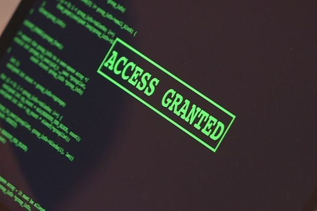

<!-- You Don't Have to Be a Villain to Hack Like One (Legally!): A Guide to Ethical Hacking -->
## You Don't Have to Be a Villain to Hack Like One (Legally!)
<!-- *** -->

<!--  -->

Ever heard of hacking and instantly pictured a guy in a hoodie hunched over a glowing screen, typing furiously in a basement lit by Christmas lights? Yeah, that's Hollywood's version. In the real world, hacking can be a **digital Robin Hood**, stealing not from the rich, but from the bad guys' playbook to protect our data and systems. Ethical hackers are the ultimate digital knights in shining armor, using their skills for good – and they're in high demand!

## So, Who Exactly as an Ethical Hacker?

Imagine you live in a fantastically secure treehouse (because why not ditch the castle for something cooler?). You wouldn't leave the rope ladder dangling or forget the combination to the trapdoor, right? Ethical hackers are like security consultants for your digital treehouse. They use their hacking skills, the same ones malicious actors might use, to find weaknesses in your computer systems before anyone with malicious intent does. They're basically the good guys testing your defenses to make sure you're not an easy target for virtual tree-raiding scoundrels.

> _Think of it like this:_ Your treehouse has a secret branch only squirrels know about (a vulnerability). An ethical hacker climbs that branch and tells you, "Hey, you have a hidden entrance anyone with a bushy tail can access!" Then, you can reinforce the branch (patch the vulnerability) before a sneaky raccoon steals your stash of gummy bears (your data).
{: .prompt-info }

## Responsibilities?

But with great hacking power comes great responsibility. Ethical hackers follow a strict code, kind of like a hacker's commandments carved on a pretzel stick (because who doesn't love a good pretzel?):

+ *Thou Shalt Not Hack Without Permission:* Ethical hackers **ALWAYS** get the green light from the owner before testing their defenses. They wouldn't want to be the reason the treehouse alarms (firewalls) go off and scare away the friendly neighborhood birds (denial-of-service attack, anyone?).

- _Do No Harm:_ Their goal is to improve security, not cause problems. They wouldn't want to accidentally trigger the rope ladder retraction system and leave a friendly visitor dangling (accidental system disruption, ouch!).

+ _Keep Secrets, Secret:_ Any vulnerabilities they find are confidential, just like your secret branch. They wouldn't dream of yelling it from the highest branch for all the squirrels to hear (responsible disclosure, people!).
- *Always Report Back:* Once they find a weakness, they tell the owner so it can be fixed. They wouldn't leave you hanging with a wide-open secret branch!
The Tools of the Trade:

## Common Tools for Ethical Hackers

Ethical hackers have a cool arsenal of tools at their disposal, not unlike Batman's utility belt (but hopefully less likely to involve throwing exploding batarangs). These tools can include:

1.	_Vulnerability Scanners:_ These are like digital metal detectors, sniffing out potential weaknesses in systems and applications.
2. _Password Crackers:_ Think of them as code-breaking machines, trying different combinations to find weak passwords (like trying every key on your keychain until you find the one that unlocks the gummy bear stash!).
3. _Packet Sniffers:_ Imagine listening to whispers on the forest breeze; these tools can capture data flowing through a network, allowing analysis of communication protocols and potential security risks. (Ethical hackers use them with proper authorization to assess data encryption and security measures, not to eavesdrop on squirrel gossip!)

You can find more about the tools [here](/posts/Beyond-The-Keyboard)

## The Ethical Hacker Skillset:
Being an ethical hacker isn't just about knowing cool hacking tricks (although those are pretty neat!). It requires a unique blend of skills:
+ _Technical Expertise:_ In-depth knowledge of operating systems, network protocols, programming languages, and various hacking techniques – basically, the ABCs of the digital world.
- *Problem-Solving Skills:* Thinking like a hacker to find creative ways to bypass security, but using those skills for good instead of mischief.
+ _Communication Skills:_ The ability to clearly document findings, including technical details, exploitability assessments, and recommendations for remediation. Think of it as explaining to the treehouse owner how to reinforce the secret branch in a way they can understand (no need for fancy tech jargon!).

## The Ethical Hacking Takeaway:
Ethical hacking is a fascinating field that helps keep our information and systems safe. It's not all about dark screens and cryptic code, but about using your skills for good, protecting our digital treehouses from virtual raccoons, and ensuring a world where everyone's gummy bear stash remains secure. So, the next time you hear about hacking, remember, there's a whole world of ethical hackers out there, making the digital world a safer place, one secret branch at a time.

